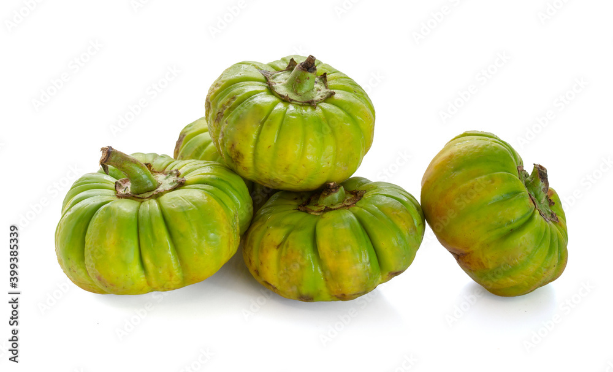
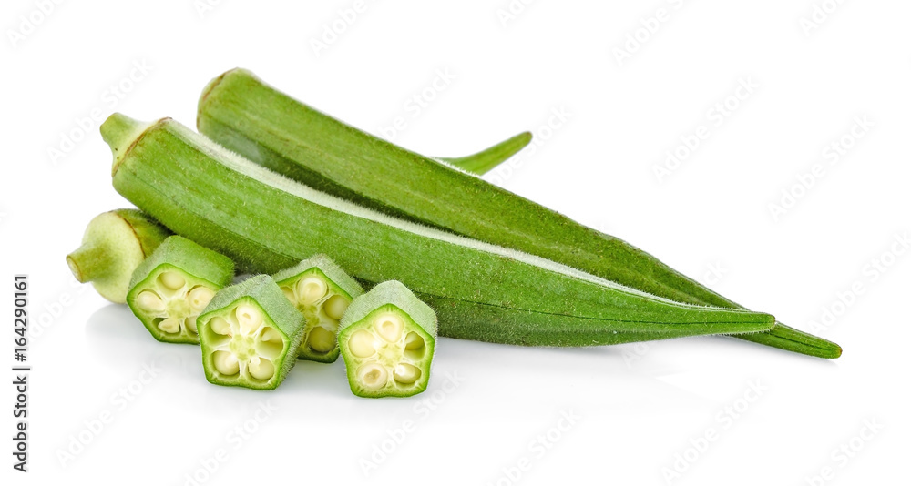
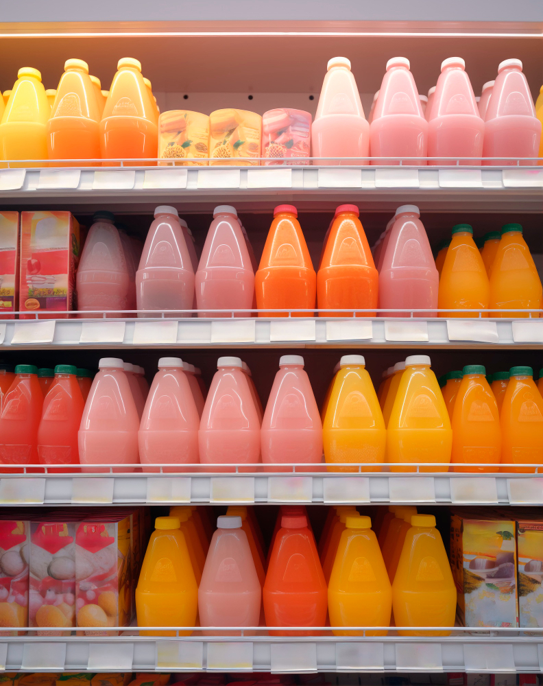

//fichier html//
<!DOCTYPE html>
<html lang="en">
<head>
    <meta charset="UTF-8">
    <meta name="viewport" content="width=device-width, initial-scale=1.0">

    <link rel="stylesheet" href="https://cdnjs.cloudflare.com/ajax/libs/font-awesome/6.4.0/css/all.min.css">
    <link rel="stylesheet" href="../projet2/style.css">
    <title>projet2 xarala</title>
</head>
<body>
        <!--header-->
        <header>
            

                
E-COMLOCAL

            

            <ul class="menu">
                <li><a href="#">Accueil</a></li>
                <li><a href="#">Produits</a></li>
                <li><a href="#">Services</a></li>
                <li><a href="#">Contact</a></li>
            </ul>
            

            
            
            <button class="btn-abon">S'abonner</button>
        

        </header>
        <section id="partie1">
            

                 <h3>produits locaux</h3>
           <h2 class="title">Transformons nos produits locaux</h2>
           
Lorem ipsum dolor sit, amet consectetur adipisicing elit. Ipsum labore non numquam ut, voluptate ad. ipsum dolor sit amet, consectetur adipisicing.

           <a href="">Acheter maintenant...</a>
        

        
        

          
        

        </section>

         <!--section 2-->
         <section id="partie2">
          

           

                
                
           

           

                        <h1>Transformation Agroalimentaire</h1>
                        
Lorem ipsum dolor sit amet, consectetur adipisicing elit. Beatae impedit cumque ipsa!
                           Lorem ipsum dolor sit amet consectetur adipisicing.
                        

                        

                        
                        
                        
                       

           

          

       </section>

        <h1 class="produits_texte"> Les Produits Locales</h1>

        <section class="section_produits">
         

         

           

           
Produits 100% Naturel

           
Piment

           

             
1500 FCFA

             <button class="achat">Ajouter</button>
 
           

          
         

 
 
         

           

           
Produits 100% Naturel

           
Patate

           

             
3500 FCFA

             <button class="achat">Ajouter</button>
 
           

          
         

 
 
         

           

           
Produits 100% Naturel

           
Oignon

           

             
3500 FCFA

             <button class="achat">Ajouter</button>
 
           

          
         

 
 
         

           

           
Produits 100% Naturel

           
Pomme de terre

           

             
2500 FCFA

             <button class="achat">Ajouter</button>
 
           

          
         

 
         

           

           
Produits 100% Naturel

           
Tomate

           

             
1000 FCFA

             <button class="achat">Ajouter</button>
 
           

          
         

 
 
         

           

           
Produits 100% Naturel

           
salade

           

             
2000 FCFA

             <button class="achat">Ajouter</button>
 
           

          
         

 
 
         

           

           
Produits 100% Naturel

           
Aubergine

           

             
2400 FCFA

             <button class="achat">Ajouter</button>
 
           

          
         

 
 
         

           

           
Produits 100% Naturel

           
Gombo

           

             
3200 FCFA

             <button class="achat">Ajouter</button>
 
           

          
         

 
         

           

           
Produits 100% Naturel

           
Diakhatou

           

             
2000 FCFA

             <button class="achat">Ajouter</button>
 
           

          
         

 
       

 
        </section>

        <section class="temoignage" id="temoignagne">
            

                <h1>Temoignages</h1>
              
Lorem ipsum, dolor sit amet consectetur adipisicing elit. Provident, doloremque. Quam id, voluptatum ipsam accusamus !

              

                

                  

                    
    
                  

                  

                    <h3>Aliou Diouf</h3>
                    
Lorem ipsum dolor sit, amet consectetur adipisicing elit. Alias, eos delectus atque neque cupiditate saepe, enim quos nulla voluptatum doloribus libero beatae facilis necessitatibus esse id deserunt doloremque magnam earum.

                   
    
                  

                

    
    
                

                  

                    
    
                  

                  

                    <h3>Idrissa Diop</h3>
                    
Lorem ipsum dolor sit, amet consectetur adipisicing elit. Alias, eos delectus atque neque cupiditate saepe, enim quos nulla voluptatum doloribus libero beatae facilis necessitatibus esse id deserunt doloremque magnam earum.

                    
                  

                

    
    
                

                  

                    
    
                  

                  

                    <h3>Lamine Sarr</h3>
                    
Lorem ipsum dolor sit, amet consectetur adipisicing elit. Alias, eos delectus atque neque cupiditate saepe, enim quos nulla voluptatum doloribus libero beatae facilis necessitatibus esse id deserunt doloremque magnam earum.

                   
                  

                

    
              

           </section>

           
           <section id="milieu">
            

                     

                             

                         
                         

                         

                         
                         
                     

                 

                       

                         

                         
Lorem ipsum dolor, sit amet consectetur adipisicing elit.
                             Provident eligendi natus dolor fuga eveniet numquam!
                             Provident eligendi natus dolor fuga eveniet numquam!

                             
Lorem ipsum dolor sit amet consectetur adipisicing elit. 
                                Porro perspiciatis officiis inventore, veniam rerum minima?
                                Provident eligendi natus dolor fuga eveniet numquam!

                             

                             

                         
                         
                     

                     

                     

        </section>

           

            <h3>NOS SERVICES</h3>
            <section class="SERVICES">
                

                    

                        
<i class="fa-solid fa-code"></i>

                            
Nectar Et Sirop De Ditax

                            
Lorem ipsum dolor, sit amet consectetur adipisicing
                              elit. Autem adipisci
                              

                            
                    

                

                

                    

                        
<i class="fa-solid fa-mobile"></i>

                            
Nectar Et Sirop De Ditax

                            
Lorem ipsum dolor, sit amet consectetur adipisicing
                             elit. Autem adipisci

                            
                    

                

                

                    

                        
<i class="fa-solid fa-paintbrush"></i>

                            
Nectar Et Sirop De Ditax

                            
Lorem ipsum dolor, sit amet consectetur adipisicing
                             elit. Autem adipisci 

                            
                    

                

           <section class="CONTACTS" id="CONTACTS">
            <h1 class="heading"> CONTACTS SN </h1>
            

                

  
                        <form action="">
                            <input type="text" placeholder="entrer votre nom" class="box">
                            <input type="email" placeholder="entrer votre email" class="box">
                            <textarea name="" id="" cols="30" rows="10" class="box message" placeholder="message"></textarea>
    
                            <button type="submit" class="btn"> ENVOYER <i class="fas fa-paper-plane"></i> </button>
                               
                        </form>
                        
                    

    
    
    
                

    
            

    
            </section>

            <footer>
              

                  

              <h2>Objectifs</h2>
              
Lorem ipsum dolor sit amet consectetur adipisicing elit. Perferendis nisi ex porro omnis, distinctio accusantium corporis odio culpa eaque, a reiciendis, totam debitis
                   at beatae quae consectetur consequatur vero cupiditate?

                  

                  

              <h2>Heures</h2>
              
Lundi: 08h-18h

              
Mardi: 08h-18h

              
Mercredi: 08h-18h

                 

                 

              <h2>Nous Contacter</h2>
              
+221 78 405 98 47

              
dioufyaliou96@gmail.com

              
Dakar Sénégal

          

          

          

          
copyrigth@ecomlocal|2024

          

          </footer>  

</body>
</html>
//fichier css//

@import url('https://fonts.googleapis.com/css2?family=Noto+Serif:ital,wght@0,100..900;1,100..900&display=swap');

*{
    margin: 0;
    padding: 0;
    font-family: noto-serif,  sans-serif;
    box-sizing: border-box;
    transition: all.2s linear;
    text-decoration: none;
    border: none;
}

html{
    font-size: 62.5%;
    overflow-x: hidden;
    scroll-padding-top: 7em;
    scroll-behavior: smooth;
}
/*body{
    position: relative;
}*/
header{
    position: fixed;
    top: 0;
    left: 0;
    right: 0;
    z-index: 20;
    background-color: #fff;
    display: flex;
    justify-content: space-between;
    align-items: center;
    padding: 10px 8%;
    height: 65px;
    box-shadow: 0 0 10px 0 rgba(0, 0, 0, 0.2);
}
/*
.droite{
    display: inline-block;
  
}*/
.recher{
    width: 20px;
   
}
.panier{
   
    width: 20px;
    margin-left: 20px;
}
.btn-abon{
    padding: 15px;
    margin-left: 25px;
    background-color: rgb(7, 107, 7);
    color: #fff;
    border-radius: 6%;
    cursor: pointer;
}
.btn-abon:hover{
    color: #000;
}
header .logo{
    color: rgb(7, 107, 7);
    font-size: 25px;
    font-weight: bold;
}
header .logo span{
    color: #000;
}
.menu{
    display: flex;
   margin-right: 25%;
}
.menu li{
    list-style: none;
    margin: 0 15px;
    font-size: 20px;
}

.menu li a{
    color: #000;
    font-size: 20px;
}
.menu li a:hover{
    color: rgb(7, 107, 7);
}
#partie1{
    margin-top: 10%;
    height: calc(100vh -50px);
    padding: 0 8%;
    display: flex;
    align-items: center;
    justify-content: space-between;
    position: relative;
}

#partie1 .left{
    width: 40%;
   
}
#partie1 .left h3{
    font-size: 25px;
    padding: 15px;
    font-weight: 300;
    color: rgb(7, 107, 7);
}
#partie1 .left h2{
    font-size: 40px;
}
#partie1 .left p{
font-size: 20px;
padding: 15px;
color: #000;

}
#partie1 .left a{
    font-size: 20px;
    background-color: rgb(7, 107, 7);
    color: #fff;
    padding: 15px;
   border-radius: 7px;
   margin: 15px ;
   cursor: pointer;
}
#partie1 .left a:hover{
    color: #000;
}
.right img{
    display: flex;
    margin: 10px;
}
.right .img1{
width: 50px;
border-radius: 70%;

}
.right .img2{
    width: 50px;
    border-radius: 20%;
    }
    .right .img3{
        width: 50px;
        border-radius: 70%;
        }
        .right .img4{
            width: 50px;
            border-radius: 70%;
            }
            .right .img5{
                width: 50px;
                border-radius: 70%;
                }

                .produits_texte{
                    text-align: left;
                    font-size: 30px;
                    font-weight: 300;
                    margin-top: 30px;
                    margin-left: 80px;
                    color: #228b22;
                    text-align: center;
                
                
                }
                
                .section_produits{
                    padding: 40px 5%;
                }
                
                .produits{
                    display: grid;
                    grid-template-columns: repeat(auto-fit, minmax(320px, 1fr));
                
                }
                
                .produits .carte{
                    width: 310px;
                    background: #f5f5f5;
                    box-shadow: 0 10px 20px rgba(0, 0, 0, 0.3);
                    border-radius: 10px;
                    margin-bottom: 20px;
                }
                
                .produits .carte img{
                    height: 250px;
                    width: 100%;
                    border-radius: 10px;
                
                }
                
                
                .produits .carte img:hover{
                    transform: scale(1.2);
                
                }
                
                .produits .carte .desc{
                    padding: 5px 20px;
                    opacity: 0.8;
                
                }
                
                .produits .carte .titre{
                    font-weight: 900;
                    font-size: 20px;
                    color: #228b22;
                    padding: 0 20px;
                    text-align: left;
                
                }
                
                .produits .carte .box{
                    display: flex;
                    justify-content: space-between;
                    align-items: center;
                    padding: 20px;
                  
                }
                
                .produits .carte .prix{
                    color: black;
                    font-size: 20px;
                    font-weight: bold;
                   
                  
                
                }
                
                .produits .carte .achat{
                    font-size: 13px;
                    font-weight: 900;
                    color: black;
                    padding: 10px 18px;
                    border-radius: 5px;
                  
                
                }
                
                .produits .carte .box .achat:hover{
                    cursor: pointer;
                    background: #228b22;
                    color: white;
                
                }
                
                
                

                .temoignage{
                    background-image: url(./imgs/leg5.jpg);
                    background-size: cover;
                }

                h1{
                    text-align: center;
                    color: #fff;
                    font-size: 50px;
                }

                p{
                    text-align: center;
                    font-size: 20px;
                    padding: 15px;
                   color: #fff;
                }
                
                .temoignage .contenu{
                    display: flex;
                    margin-top: 40px;
                    width: 100%;
                    justify-content: center;
                    align-items: center;
                    flex-wrap: wrap;
                    flex-direction: row;
                }
                
                .temoignage .contenu .box{
                    width: 340px;
                    margin: 20px;
                    background: #fff;
                    display: flex;
                    justify-content: center;
                    align-items: center;
                    flex-direction: column;
                    border-radius: 15px;
                    
                }
                
                .temoignage .contenu .box .imbox{
                     width: 80px;
                     height: 80px;
                     border-radius: 50px;
                    position: relative;
                    margin-bottom: 20px;
                    overflow: hidden;
                
                }
                
                .temoignage .contenu .box .imbox .img{
                    position: relative;
                    width: 100%;
                    height: 100%;
                    top: 0%;
                    left: 0%;
                    object-fit: cover;
                    justify-content: center;
                    align-items: center;
                }
                
                .temoignage .contenu .box .text{
                    text-align: center;
                    color: #666;
                    font-style: italic;
                    
                }
                
                .temoignage .contenu .box .text h3{
                     color: #228b22;
                     margin-top: 20px;
                     font-size: 2rem;
                     font-weight: 600;
                }
                
                .blanc .titre-texte{
                    color: #fff;   
                }
                
                .blanc .titre-texte,
                .blanc p{
                    color: #666;
                }

                .heading{
                    text-align: center;
                    padding: 2rem 0;
                    padding-bottom: 3rem;
                    font-size: 3.5rem;
                    color: var(--black);

                }

                .CONTACTS .row{
                    background-image: url(./imgs/logo.png);
                    display: flex;
                    align-items: center;
                    justify-content: center;
                    flex-wrap: wrap;
                
                }

                .CONTACTS .row .content{
                    flex: 1 1 30rem;
                    padding: 4rem;
                    padding-bottom: 0;
                
                }

                .CONTACTS .row form{
                    flex: 1 1 45rem;
                    padding: 2rem;
                    margin: 2rem;
                    padding-bottom: 0;
                    margin-bottom: 4rem;
                } 

                .CONTACTS .row form .box{
                    padding: 1.5rem;
                    margin: 1rem 0;
                    background: #3333;
                    color: #fff;
                    text-transform: none;
                    font-size: 1.7rem;
                    width: 100%;
                }

                .CONTACTS .row form .box::placeholder{
                    text-transform: capitalize;
                }

                .CONTACTS .row form .message{
                    height: 15rem;
                    resize: none;
                }

                .CONTACTS .row .content .title{
                    text-transform: uppercase;
                    color: #fff;
                    font-size: 3rem;
                    padding-bottom: 2rem;
                
                }

                .CONTACTS .row .content .info h3{
                    display: flex;
                    align-items: center;
                    font-size: 2rem;
                    color: #eee;
                    padding: 1rem 0;
                    font-weight: normal;    
                }

                .CONTACTS .row .content .info h3 i{
                    padding-right: 1rem;
                    color: var(--yellow);
                }
                
                .top{
                    position: fixed;
                    bottom: 7.5rem; right: 2rem;
                    z-index: 100;
                }

                .CONTACTS .row form{
                    margin: 3rem 0;
                
                }

                button{
                    background-color: #228b22;
                    border: none;
                    color: white;
                    padding: 15px 32px;
                    text-align: center;
                    display: inline-block;
                    font-size: 20px;
                   
                }

                .foot{
                    width: 100%;
                    display: flex;
                    align-items: center;
                    justify-content: space-between;
                   height: auto;
                   background-color: #000;
                   color: #fff;
                   margin-top: 10px;
                }
                .lor1{
                    width: 30%;
                    margin: 25px;
                }
                .lor2{
                    width: 20%;
                    margin-left: 35px;
                }
                .lor3{
                    margin-left: 25px;
                    width: 20%;
                }
                .foot p{
                    text-align: center;
                    font-size: 18px;
                }
                .foot h2{
                    font-size: 25px;
                    padding: 15px;
                    font-weight: bold;
                    text-align: center;
                }
                .foo p{
                    text-align: center;
                    background-color: #fff;
                    color: #000;
                    font-size: 18px;
                    border-bottom: 1px solid #c1c1c1;
                   padding: 10px;
                }

/*section 2*/
#partie2{
    width: 100%;
}
.left-1{
    width: 75%;
    display: flex;
    align-items: center;
    justify-content: space-between;
   margin-left: 10%;
}
.left-1-1{
    width: 30%;
    height: 70%;
    margin: 25px 30px;
    background-color: #fff;
    box-shadow: 0 0 10px 0 rgba(0, 0, 0, 0.5);
    padding: 30px 50px;
}
.left-1-1 img{
    width: 170px;
    justify-content: center;
    align-content: center;
    margin: 10px;
  
}
.right-1{
    width:max-content;
    height:auto;
    background-color: #fff; 
    padding: 45px;  
    box-shadow: 0 0 10px 0 rgba(0, 0, 0, 0.5);
    left: 40px;
}
.right-1 h1{
    font-size: 27px;
    color: rgba(206, 33, 119, 0.5);
    text-decoration: underline;
    font-weight: 600;
}
.right-1 p{
    font-size: 20px;
    margin-top: 15px;
}
.right-1 img{
    width: 120px;
    height: 100px;
}
.image{
    display: flex;
    flex-direction: row;
    justify-content: space-between;
    margin-top: 25px;
}
.image img{
   
    border: 3px solid #c1c1c1;
   border-top-right-radius: 60px;
   border-bottom-left-radius: 40px;
  
   
}
/*.right .img1{

border-radius: 70%;

}
.right .img2{
    width: 50px;
    border-radius: 20%;
    }
    .right .img3{
        width: 50px;
        border-radius: 70%;
        }
        .right .img4{
            width: 50px;
            border-radius: 70%;
            }
            .right .img5{
               
                border-radius:calc(-50px -50px);
                }*/

h3{
    text-align: center;
    font-size: 40px;
}

.container .SERVICES{
    justify-content: space-around;
    display: flex;
    flex-wrap: wrap;
    align-items: center;

}

.container .SERVICES .card{
    width: 250px;
    height: 200px;
    text-align: center;
    background: #222;
    padding: 20px 15px;
    margin-bottom: 30px;
    border-radius: 10px;
    cursor: pointer;
    transition: 0.3s;
}

.container .SERVICES .card:hover{
    background: #228b22;
}

.container .SERVICES .card:hover .content{
    transform: scale(1.07);
}

.container .SERVICES .card .content .icon{
    padding: 5px 0;
    color: white;
}

.container .SERVICES .card .content .icon i{
    font-size: 60px;
}

.container .heading span{
    color: #000;
}

.heading{
    font-size: 4rem;
    padding-bottom: 1rem;
    color: #fff;
    text-transform: uppercase;

}

.heading span{
    color:var(--main-color);
    text-transform: uppercase;
    
}

.btn{
    display: inline-block;
    margin-top: 1rem;
    padding: .8rem 3rem;
    background: var(--main-color);
    color: yellow;
    cursor: pointer;
    font-size: 1.7rem;
    
}

.btn:hover{
    background: #111;
    letter-spacing: 1rem;

}

#milieu{
    width: 100%; 
}

#milieu .tout{
    width: 100%;
}

.div1 .left0 img{
    width: 50%;
    margin-left:  30%;
}
.div1 .right0 img{
    width: 30%; 
   margin-right: 15%; 
   
}
#milieu .div2 .left1 p{
    width: 50%;
    padding: 18px;
    font-size: 18px;
    margin-left:  20%;
    font-weight: lighter;
    color: #999;
}
.div2 .right1 img{
    width: 30%; 
    margin-right: 5%;
}

.div1{
    width: 100%;
    display: flex;
    align-items: center;
    justify-content: space-between;
}
.div2{
    width: 100%;
    display: flex;
    align-items: center;
    justify-content: space-between;
}

                
                

